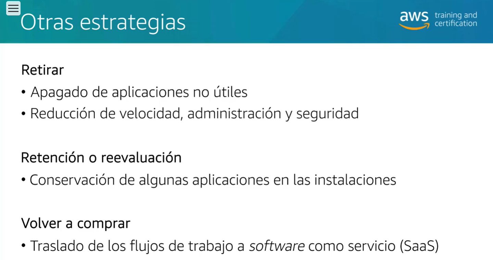
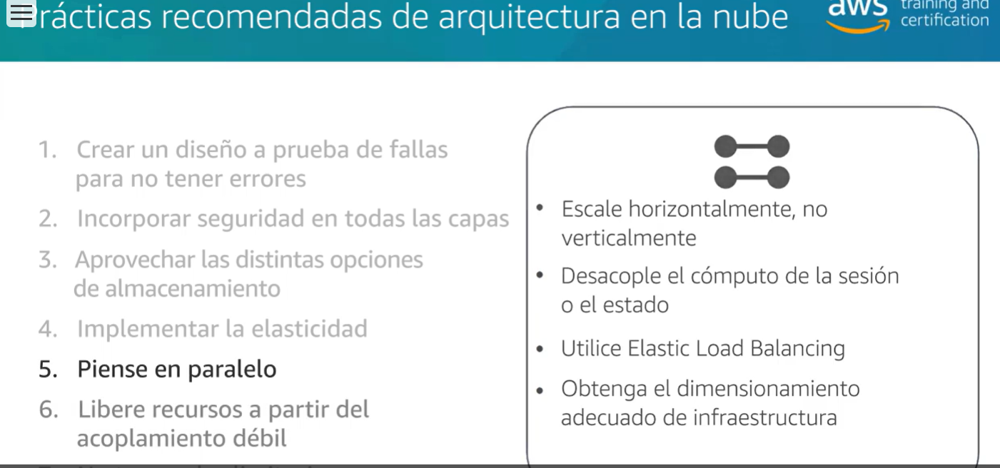
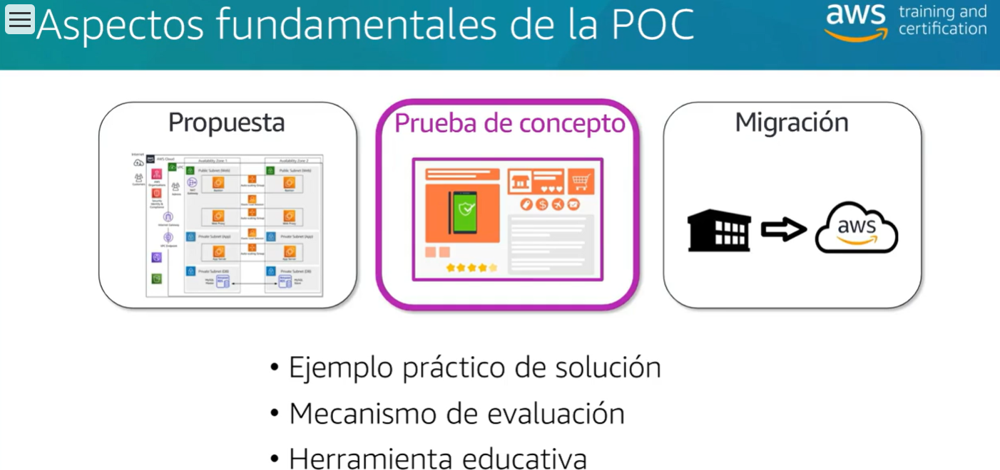

# AWS Cloud Practitioner Essentials

## Precios Amazon EC2

Con Amazon EC2, solo paga por el tiempo de cómputo que utiliza. Amazon EC2 ofrece diversas opciones de precios para distintos casos de uso. Por ejemplo, si su caso práctico puede soportar interrupciones, puede ahorrar con las instancias de spot. También puede ahorrar si se compromete de forma anticipada y reserva un nivel mínimo de uso con las instancias reservadas.

### Bajo demanda

Las instancias bajo demanda son ideales para cargas de trabajo irregulares a corto plazo que no se pueden interrumpir. No se aplican costos iniciales ni contratos mínimos. Las instancias se ejecutan de forma continua hasta que las detiene y solo paga por el tiempo de cómputo que utiliza.

Los casos prácticos de muestra de instancias bajo demanda incluyen el desarrollo y la prueba de aplicaciones y la ejecución de aplicaciones que tienen patrones de uso impredecibles. Las instancias bajo demanda no se recomiendan para cargas de trabajo que duran un año o más porque dichas cargas pueden experimentar un mayor ahorro de costos mediante instancias reservadas.

### Instancias Reservadas

Las instancias reservadas son un descuento de facturación que se aplica al uso de instancias bajo demanda en su cuenta. Hay dos tipos de instancias reservadas disponibles:

- las instancias reservadas Standard
- las instancias reservadas convertibles

Puede comprar las instancias reservadas Standard y las reservadas convertibles por un periodo de 1 año o de 3 años. Consigue mayores ahorros de costos con la opción de 3 años.

#### Instancias reservadas Standard 

Esta opción es buena si conoce el tipo de instancia de EC2 y el tamaño que necesita para las aplicaciones de estado estable y en qué región de AWS planea ejecutarlas. Las instancias reservadas necesitan que establezca las siguientes calificaciones:

- **tipo de instancia y tamaño:** por ejemplo, m5.xlarge
- **descripción de la plataforma (sistema operativo)**: por ejemplo, Windows Server de Microsoft o Red Hat Enterprise Linux
- **tenencia**: tenencia predeterminada o tenencia dedicada
Tiene la opción de especificar una zona de disponibilidad para las instancias reservadas de EC2. Si realiza esta especificación, obtendrá la reserva de capacidad de EC2. Esto asegura que las instancias de EC2 que desea estén disponibles cuando las necesite

#### Instancia reservada convertible

si debe ejecutar las instancias de EC2 en una zona de disponibilidad diferente o tipos de instancias diferentes, es posible que las instancias reservadas convertibles sean las indicadas para usted. Nota: Consigue un mejor descuento cuando necesita flexibilidad para ejecutar las instancias de EC2.

Al final del periodo de una instancia reservada, puede continuar utilizando la instancia de EC2 sin interrupciones. Sin embargo, se le cobrará tarifas bajo demanda hasta que realice una de las siguientes acciones:

- Termine la instancia.
- Adquiera una nueva instancia reservada que coincida con los atributos de la instancia (familia y tamaño, región, plataforma y tenencia de la instancia).

### Savings Plans de una instancia EC2

AWS ofrece Savings Plans para algunos servicios de cómputo, incluido Amazon EC2. Los Savings Plans de las instancias de EC2 reducen los costos de las instancias de EC2 cuando se compromete a realizar gastos por hora a una familia de instancias y a una región por un periodo de 1 año o de 3 años. Este compromiso del periodo genera ahorros de hasta el 72 % comparado a las tarifas bajo demanda. Cualquier uso hasta el compromiso se cobra según la tarifa de Savings Plans con descuento (por ejemplo, 10 USD por hora). Cualquier uso más allá del compromiso se cobra en base a las tarifas bajo demanda regulares.

Los Savings Plans de las instancias de EC2 son una buena opción si necesita flexibilidad en su uso de Amazon EC2 sobre la duración del periodo de compromiso. Tiene el beneficio de ahorrar en la ejecución de cualquier instancia de EC2 dentro de una familia de instancias de EC2 en una región elegida (por ejemplo, el uso de M5 en Virgina del Norte) sin importar la zona de disponibilidad, el tamaño, el sistema operativo o la tenencia de la instancia. Los ahorros con los Savings Plans de las instancias de EC2 son similares a los ahorros suministrados por las instancias reservadas Standard.

Sin embargo, al contrario de las instancias reservadas, no debe especificar de antemano el tipo y el tamaño de la instancia de EC2 (por ejemplo m5.xlarge), el sistema operativo ni la tenencia para obtener un descuento. Además, no debe comprometerse a un número determinado de instancias de EC2 durante un periodo de 1 año o de 3 años. Asimismo, los Savings Plans de las instancias de EC2 no incluyen una opción de reserva de capacidad de EC2.

Más adelante en este curso, analizará el explorador de costos de AWS, que puede utilizar para visualizar, entender y administrar los costos y el uso de AWS a través del tiempo. Si está considerando las opciones de Savings Plans, puede utilizar el explorador de costos de AWS para analizar el uso de Amazon EC2 durante los últimos 7, 30 o 60 días. El explorador de costos de AWS también proporciona recomendaciones personalizadas para los Savings Plans. Estas recomendaciones calculan cuánto podría ahorrar en los costos mensuales de Amazon EC2, en función del uso anterior de Amazon EC2 y del importe del compromiso por hora de un Savings Plan de 1 o 3 años.

### Instancias Spot

Las instancias de spot son ideales para las cargas de trabajo con tiempos de inicio y finalización flexibles, o que pueden resistir interrupciones. Las instancias de spot utilizan capacidad de cómputo de Amazon EC2 no utilizada y ofrecen ahorros con un descuento de hasta el 90 % de los precios bajo demanda.

Imagine que tiene un trabajo de procesamiento en segundo plano que puede iniciarse y detenerse según sea necesario (como el trabajo de procesamiento de datos de una encuesta de clientes). La intención es iniciar y detener el trabajo de procesamiento sin afectar a las operaciones generales de su empresa. Si realiza una solicitud de spot y la capacidad de Amazon EC2 está disponible, se lanza la instancia tipo spot. Sin embargo, si realiza una solicitud de spot y la capacidad de Amazon EC2 no está disponible, la solicitud no se realizará correctamente hasta que la capacidad esté disponible. La capacidad no disponible puede retrasar el inicio del trabajo de procesamiento en segundo plano.

Después de lanzar una instancia de spot, si la capacidad ya no está disponible o aumenta la demanda de instancias de spot, es posible que la instancia se interrumpa. Es posible que esto no suponga ningún problema para el trabajo de procesamiento en segundo plano. Sin embargo, en el ejemplo anterior de desarrollo y prueba de aplicaciones, lo más probable es que desee evitar interrupciones inesperadas. Por lo tanto, elija un tipo de instancia de EC2 diferente que sea ideal para esas tareas.

### Servidores dedicados

Los servidores dedicados son servidores físicos con capacidad de instancias de Amazon EC2 totalmente dedicados a su uso. 

Puede utilizar las licencias de software por zócalo, por núcleo o por máquina virtual (VM) existentes para ayudar a mantener el cumplimiento de las licencias. Puede comprar reservas de hosts dedicados y hosts dedicados bajo demanda. De todas las opciones de Amazon EC2 cubiertas, los hosts dedicados son los de mayor costo.

## Escalado de Amazon EC2

### Escalabilidad

La escalabilidad implica comenzar solo con los recursos que necesita y diseñar la arquitectura para responder automáticamente a la demanda cambiante mediante el escalado o la reducción horizontal. Como resultado, solo paga por los recursos que utiliza. No tiene que preocuparse por la falta de capacidad de cómputo para satisfacer las necesidades de sus clientes.

Si quisiera que el proceso de escalado se realizara automáticamente, ¿qué servicio de AWS utilizaría? El servicio de AWS que proporciona esta funcionalidad para las instancias de Amazon EC2 es Amazon EC2 Auto Scaling.

### Amazon EC2 AutoScaling

Si ha intentado acceder a un sitio web que no se cargaba y que con frecuencia se agotaba el tiempo de espera, es posible que el sitio haya recibido más solicitudes de las que pudo gestionar. Esta situación es similar a esperar en una larga fila en una cafetería, cuando solo hay un barista presente para recibir pedidos de los clientes.

**Ejemplo: Amazon EC2 Auto Scaling**
En la nube, la potencia de cómputo es un recurso programático, por lo que puede adoptar un enfoque más flexible en el tema del escalado. Al añadir Amazon EC2 Auto Scaling a una aplicación, puede añadir nuevas instancias a la aplicación cuando sea necesario y cancelarlas cuando ya no las necesite.

Imagine que se está preparando para iniciar una aplicación en instancias de Amazon EC2. Al configurar el tamaño del grupo de Auto Scaling, puede establecer el número mínimo de instancias de Amazon EC2 en una. Esto significa que, en todo momento, debe haber al menos una instancia de Amazon EC2 funcionando.

A continuación, puede establecer la capacidad deseada en dos instancias de Amazon EC2, aunque su aplicación necesite un mínimo de una sola instancia de Amazon EC2 para funcionar.

<code>
Si no especifica el número deseado de instancias de Amazon EC2 en un grupo de Auto Scaling, la capacidad deseada se establece de forma predeterminada en la capacidad mínima.</code>

La tercera configuración que puede establecer en un grupo de Auto Scaling es la capacidad máxima. Por ejemplo, puede configurar el grupo de Auto Scaling para que escale horizontalmente en respuesta al aumento de la demanda, pero solo hasta un máximo de cuatro instancias de Amazon EC2.

Dado que Amazon EC2 Auto Scaling utiliza instancias de Amazon EC2, solo paga por las instancias que utiliza, cuando las utiliza. Ahora cuenta con una arquitectura rentable que proporciona la mejor experiencia al cliente y reduce los gastos.
# AWS Conceptos Certificacion Practitioner

# AWS Partner: Accreditation

### Servicios de computo

Desarrollar, implementar, ejecutar y escalar cargas de trabajo en la nube de AWS.

- **Amazon EC2**: Capacidad de computo de tamaño modificable
- **Amazon EC2 Auto Scaling**: Aumentar o disminuir el numero de instancias
- **Elastic Loan Balancing**: Distribuir el trafico entrante
- **Amazon Elastic Container Service**: Ejecutar aplicaciones en un cluster administrado
- **Amazon Elastic Kubernetes Service**: Ejecutar aplicaciones de cubernetes en AWS y en las instalaciones
- **AWS Lambda**: Ejecutar codigo de respuesta a eventos

#### Beneficios de Amazon EC2

- Elasticidad
- Control
- Flexibilidad
- Integracion
- Fiable
- Proteccion
- Rentabilidad
- Sencillo

#### Opciones de Amazon EC2: tipos de instancias

Amplia seleccion de configuraciones de harware y software optimizadas para adaptarse a diferentes casos practicos.

- **General Purpose:** Proporciona una combinacion equilibrada de recursos
- **Compute Optimized**: Son ideales para las aplicaciones que dependen de los recursos de computo y se benefician de los procesadores de alto rendimiento
- **Memory Optimized**: estan diseñadas para ofrecer un rendimiento rapido para cargas de trabajo que procesan grandes conjuntos de datos en la memoria.
- **Accelerated Computing**: usan aceleradores de hardware o procesadores de codigo para realizar funciones, como el calculo de numeros de coma flotante, el procesamiento de graficos, concordancia de patrones de datos, con una mayor eficacia comparado con un software que se ejecuta en un cpu.
- **Storage Optimized**: sirven para las cargas de trabajo que requieren un acceso secuencial de lectura y escritura a los conjuntos de datos en el almacenamiento local. Estan optimizados para entregar decenas de miles de operaciones E/S aleatorias de baja latencia por segundo, o IOPS, a las aplicaciones

#### Por que el escalado es importante

1. Ejecucion de nuevas instancias antes de los periodos de carga maxima.
1. Uso de supervision para escalar horizontalmente mediante programacion
1. Reduccion horizontal automatica
1. Pago por los recursos necesarios cuando sea necesario

#### EC2 AutoS caling

- Ajusta automaticamente los recursos
- Defina donde Amazon E2C Auto Scaling implementa los recursos
- Especifique la Amazon VCP y las subredes

Capacidad minima: Garantiza que siempre tenga instancias E2C en constante ejecucion.

Capacidad Maxima: Hace que Amazon Auto Scaling escale horizontalmente el numero de instancias de E2C para gestionar el aumento de demanda.

Capacidad Deseada: Debe ser mayor o igual al limite minimo o inferior o igual al limite maximo.

#### Elastic Loan Balancing

Distribucion automatica del trafico entre varias instancias E2C.

- Mayor disponibilidad y tolerancia a errores.
- Configuracion de comprobacion de estados.
- Reasignacion de cifrado y descifrado.

Admite 3 tipos de carga:

1. **Application Load Balancer(Equilibrador de carga de aplicacion):** Especialmente diseñado para aplicaciones web
1. **Network Load Balancer(capa de red)**: Opera en la capa de red y es mas resistentes a los picos de traficos repentinos.
1. **Gateway Load Balancer**: Dirige el trafico a los dispositivos virtuales que se encuentran en AWS Marketplace.

**AMI**: Amazon Machine Images

#### En resumen

**Instancias EC2** = bloques de creacion.
Aplicar **AMI** para personalizar.
Configurar el escalado automatico y el equilibrio de carga.
Pago por lo que utilizo.

### Introducción al almacenamiento AWS

Esta sección se centra principalmente en Amazon Simple Storage Service (Amazon S3) y Amazon Elastic Block Store (Amazon EBS),

#### Servicios de almacenamiento

Un lugar fiable, escalable y seguro para los datos

- **Amazon Elastic Block Store:** Almacenamiento persistente a nivel de bloque.
- **Amazon S3**: Almacenamiento de objetos duradero y escalable.
- **Amazon S3 Glacier**: Archivado y respaldo de datos.
- **AWS Storage Gateway**: Integracion del almacenamiento en la nube con cargas de trabajo en las instalaciones.
- **Amazon Elastic File System**: Almacenamiento de archivos para las instancias de Amazon EC2.
- **Amazon FSx**: Almacenamiento de archivos para sistemas de archivos muy utilizados.

#### Clases de almacenamiento S3

- Amazon S3 Standard.
- Amazon S3 Standard - Acceso proco frecuente.
- Amazon S3 One Zone - Acceso proco frecuente.
- Clases de almacenamiento de S3 Glacier.

S3 Intelligent-Tiering mueve automaticamente los objetos entre niveles segun los patrones de acceso.

Amazon Glacier: almacenamiento de copias de seguridad a largo plazo.

### Introducción a los servicios de base de datos de AWS

- **Amazon Relational Database Service (RDS):** Capacidad rentable de tamaño modificable. Es un servicio de BD relacionales con 6 motores de BD populares
- **Amazon DynamoDB**: Rendimiento rapido y predecible. Es una BD noSQL
- **Amazon Elastic Cache**: Recuperacion de informacion rapida y administrada. Es un servicio de cache para implementar, usar y escalar cache en memoria en la nube.

#### Ventajas de RDS

1. Facil configuracion, administracion y mantenimiento.
1. Reduccion de las cargas pesadas sin diferenciar.
1. Alta disponibilidad con un boton de comando.
1. Respaldo y recuperacion automatico.
1. Escalar o reducir verticalmente en funcion del patron.

#### Ventajas Bases de datos en EC2

1. Mayor control y flexibilidad.
1. Acceso al sistema operativo.
1. Necesidades de funciones de una aplicacion especifica.

#### En resumen

Su enfoque es reemplazar las tareas de administracion por procesos de valor agregado.

### Introducción a las redes

Aislamiento de la infraestructura de la nube y escalado de capacidad de gestion de solicitudes.

- **Amazon VPC(Virtual private cloud):** Crear una red virtual en la nube.
- **Grupos de seguridad**: Control de acceso a la instancias.
- **Listas de control de acceso a la red(NACL)**: Control de acceso a las subredes
- **Amazon Route 53**: Enrutar a los usuarios finales a aplicaciones de internet.

### Introducción a la seguridad en AWS

En AWS, la segurida en la nube es la mayor prioridad.

- Posibilidad de heredar los beneficios del centro de datos y la arquitectura de red AWS.
- Similitud con los centros de datos en las instalaciones, sin mantenimiento de instalaciones ni hardware.
- Capacidad de automatizacion con facilidad.
- Posibilidad de heradar todas las practicas recomendadas de AWS.

AWS se creo con el fin de ayudar a crear una infraestrutura segura, de alto desempeño, resiliente y eficiente para aplicaciones.

#### Servicios seguridad, identidad y conformidad

- **Identity an Access Managment(IAM):** Administra identidades, recursos y permisos de forma segura a gran escala.
- **Proteccion de infraestructura**: Inspecciona y filtra el trafico para evitar el acceso no autorizado en el host, la red y aplicacion.
- **Conformidad**: Monitorea constantemente su entorno con verificaciones basadas en las mejores practicas recomendadas por AWS y los estandares del sector de la organizacion.

#### Administracion segura del acceso a los recursos y servicios de AWS

1. Control de acceso detallado de los recursos AWS.
1. Autenticacion multifactor.
1. Capacidad de analizar el acceso.
1. Integracion de directorios corporativos.

### Resumen

#### Interfaces de administración de AWS

Los usuarios de AWS pueden crear y administrar recursos en la plataforma de tres formas. Las tres opciones se basan en una interfaz de programa de aplicación (API) común de REST que funciona como la base de AWS.

**La consola de administración de AWS** proporciona una interfaz gráfica completa para la mayoría de las características que ofrece AWS. Facilita la administración en la nube para todos los aspectos de la cuenta de AWS del cliente, incluido el monitoreo del gasto mensual, la administración de credenciales de seguridad y la configuración de nuevos usuarios de IAM.

**AWS Command Line Interface (AWS CLI)** proporciona un conjunto de servicios que se puede lanzar desde un programa de comando en Linux, Mac o Windows La CLI es una herramienta de código abierto que ofrece comandos para interactuar con los servicios de AWS.

**Los Kits de desarrollo de software (SDK)** de AWS son paquetes que brindan acceso a AWS en una variedad de lenguajes de programación populares. AWS administra la infraestructura como código mediante los SDK de AWS y las API que los subyacen. Estos SDK específicos del lenguaje contienen API que permiten a los clientes incorporar de forma fácil la amplia gama de servicios en la nube de AWS a su código sin tener que escribir las funciones ellos mismos.

#### Variedad y penetración de los servicios de AWS

AWS ofrece un amplio conjunto de productos y servicios basados en la nube, entre otros, cómputo, almacenamiento, bases de datos, análisis, redes, dispositivos móviles, herramientas para desarrolladores, herramientas de administración, Internet de las cosas (IoT), seguridad y aplicaciones de empresas. Estos servicios ayudan a las organizaciones a avanzar con mayor rapidez, reducir los costos de TI y les permiten escalar cuando es necesario. AWS cuenta con la confianza de las empresas más grandes y emergentes para hacer posible una amplia variedad de cargas de trabajo, como aplicaciones web y móviles, desarrollo de juegos, procesamiento y almacenamiento de datos, almacenamiento, archivado y muchas otras.

### Introduccion al diseño de soluciones

1. **Aplicaciones para empresas:** Crea servicios para cumplir requisitos unicos de seguridad conformidad, privacidad y gobernanza de las grandes organizaciones.
1. **Almacenamiento**: Copias de seguridad, recuperacion de datos y archivar datos en petabytes.
1. **Informatica sin servidor**: Crea y ejecuta aplicaciones y servicios sin servidores.
1. **Cargas de trabajo de Windows**: Capacidad flexible y escalable para aplicaciones Microsoft facil de administrar y segura.
1. **Contenedores**: Empaqueta e implementa aplicaciones ligeras y proporciona un entorno de Software uniforme y portatil para ejecutar aplicaciones y escalarlas en cualquier lugar.
1. **Machine Learning**: Plataformas y servicios eficientes y gran compatibilidad con frameworks de referencia en cualquier lugar.
1. **IoT**: Sistema de dispositivos amplios que conectan el mundo fisico con la nube.
1. **Analisis y lagos de datos**: almacen, categoria y analisis de datos en repositorio central.

***Grafico de solucion***

#### Gestión de los desafíos de los clientes

#### Estrategias de migración

Las 7 R:

1. Re alojar(Volver a alojar)
1. Redefinir la plataforma
1. Reubicar
1. Refactorizar
1. Retirar
1. Retener
1. Re comprar(Volver a comprar)

Las 4 primeras migran cargas de trabajo a la nube. Las demas son otras opciones para abordar las arquitecturas en las instalaciones.

**Volver a alojar: Lift and shift**

**Reubicar: nivel hipervisor lift and shift**

**Redefinicion de plataforma: lift, tinker, and shift**

**Refactorizacion: Modernizacion**

**Otras estrategias:**

#### Prácticas recomendadas de arquitectura en la nube

1. **Crear un diseño a prueba de fallas para no tener errores**:

1. **Incorporar seguridad en todas las capas**:

1. **Aprovechar las distintas opciones de almacenamiento**:

1. **Implementar elasticidad**:

1. **Piense en paralelo**:

1. **Libere Recursos a partir del acoplamiento debil**:

1. **No temas a las limitaciones**:

#### El Marco de Buena Arquitectura de AWS

***Ejemplo de buena arquitectura: optimización de costos***

Una de las tantas diferencias entre un entorno en las instalaciones y AWS es que, en AWS, los clientes pagan solo por lo que utilizan. La optimización de costos también garantiza que los clientes solo paguen por lo que necesitan, al ejecutar la cantidad exacta de recursos necesarios para realizar sus negocios. AWS ha identificado cuatro prácticas recomendadas clave para la optimización de los costos:

- **redimensionamiento de instancias**
Redimensionar el tamaño de las instancias es el proceso de revisar los recursos implementados y buscar oportunidades para reducir el tamaño cuando sea posible. Por ejemplo, si una instancia de aplicación infrautiliza constantemente su RAM y CPU, cambiarla a una instancia más pequeña puede ofrecer ahorros significativos al tiempo que se mantiene el mismo rendimiento.

- **Aumento de la elasticidad de las aplicaciones**
Por ejemplo, el escalado automático ayuda a garantizar la disponibilidad de la cantidad correcta de instancias para gestionar la carga de trabajo de una aplicación. Escalado horizontal durante la alta demanda y reducción horizontal durante la baja demanda

- **Elección del modelo de precios correcto**
Por ejemplo, el uso de instancias reservadas para cargas de trabajo que necesitan ejecutarse la mayor parte del tiempo o todo el tiempo, como los entornos de producción. Puede tener un impacto significativo en los ahorros en comparación con las instancias bajo demanda, en algunos casos hasta en un 75 %.
- **Optimización del almacenamiento**
Por ejemplo, el almacenamiento de S3 Intelligent-Tiering está diseñado para optimizar los costos mediante la migración automática de los datos a la capa de almacenamiento más rentable.

#### Marco de adopción de la nube de AWS (CAF de AWS)

#### Solucion propuesta

### Presentacion de las soluciones de AWS a los clientes

#### Fases clave

Las discusiones orientadas al cliente se dividen en tres categorías distintas, según los hitos típicos en el ciclo de ventas.

1. ***La detección*** es la recopilación de información para ayudarlo a comprender los desafíos de su cliente.

1. Una vez que recopila toda la información necesaria que identifique los objetivos y puntos débiles del cliente, se reunirá nuevamente con el cliente ***para presentar sus resultados y proponer una o más soluciones de AWS***. Esto puede dar como resultado varias reuniones, dependiendo de si se necesitan ajustes a la solución.

1. Una vez que el cliente acepte una posible solución, le preguntará siquiere avanzar con una ***prueba de concepto (POC)***, en la que se evaluará la solución en su propio entorno.

**Prácticas recomendadas de detección**

#### Manejo de objeciones

**Clave para obtener resultados uniformes**

#### POC

***Prueba de concepto se refiere a pruebas de la arquitectura a implementar en AWS en una version no productiva***

**Aspectos Fundamentales**

**Creacion de una POC**

**Recursos para pruebas de concepto(POC)**

**Recursos para la POC**

## Dominio I: Conceptos de la nube de AWS

### On Premise

Con mis propios recursos. Es decir hacer realizar el despliegue requerido con recursos propios. Por mencionar algunos de ellos:

- Rentas o construccion de inmueble(data center)
- Seguros
- Luz, internet
- Licencias
- Salarios
- Equipo(Servidores, routers, cables, herramientas, monitores, computadores)

### Cloud

Nube. Es decir solo se renta el servicio dependiendo de las necesidades de la aplicacion o despliegue. En caso de requerir mas servidores o requerimientos se renta lo antes mencionado.

### On Premise vs Cloud

|**On Premise**                             |**Cloud**                                                                                                                                                                                                                   |
|-------------------------------------------|----------------------------------------------------------------------------------------------------------------------------------------------------------------------------------------------------------------------------|
|Costes Fijos de Harware                    |Pago por uso                                                                                                                                                                                                                |
|Precios de adquisicion de usuario final    |Precios de gran proveedo (economia de escala)                                                                                                                                                                               |
|Dimensionado inicial y escalado            |Disponilibidad bajo de demanda: **Escalado vertical**: contratar mas requerimientos, mas nucleos, ram, etc. **Escalado Horizontal**: Contratar mas recursos, en ves de un servidor contratar 2, dependiendo de la necesidad.|
|Tiempos y tramites de solicitud de recursos|Entrega casi inmediata                                                                                                                                                                                                      |
|Mantenimiento de centro de datos           |Externalizado                                                                                                                                                                                                               |
|Problemas para despliegues mundiales       |Red global                                                                                                                                                                                                                  |

### Capex

**Capital Expenditure**
CapEx o Capital Expenditure se refiere a los gastos de capital o las inversiones que realiza una empresa al adquirir un activo.

Por ejemplo:

- **Infraestructura de TI**
- **Equipamiento informático**
- **Automóviles**

**Características**:

- **Inversión en infraestructura física, se pierde liquidez**
- **Depreciación de la inversión en impuestos con el tiempo**
- **Se conoce el monto y se puede presupuestar**

### Opex

**Operational Expenditure**
OpEx conocido como Operational Expenditure, se refiere a los gastos operativos que realiza una empresa para que sus productos, sistemas o negocio en sí, funcionen.

Por ejemplo:

- **Compra de tóner para la impresora**
- **Arrendamiento de infraestructura**
- **Costos de mantenimiento de oficinas**

Cuando una empresa compra servicios, forman parte de OpEx, ya que no son parte de los activos, sino que se consumen por servicio, tal es el caso de los servicios en la nube, con la cual se suministran servicios bajo demanda y de forma flexible, como es IaaS, PaaS y SaaS.
**Características**

- **Gasto en productos/servicios que se facturan al consumir**
- **Sin costos iniciales, conservas liquidez, deducción del 100%**
- **No se conoce el gasto, se paga a medida que se usa**
- **El proveedor es también responsable por la adopción**

### IaaS, PaaS, SaaS

A considar que en estos tres servicios se nos presenta como una virtualizacion.
Como conclusion:

- ***programador*** opta por PaaS por el simple hecho que se cuenta con todo lo requerido para realizar el despliegue de una aplicacion.
- ***Administrador de sistemas*** opta por IaaS debido a que solo requiere una infraestructura para generar un sistema con la complejidad requerida en especifico.

#### IaaS

Infraestructura como servicios (**Infraestructure as a Services**). Ellos se encargar de mantener, actualizar en optimas condiciones lo siguiente:

- Harware
- Redes
- Almacenamiento

Yo solo me haria cargo de lo siguiente:

- Sistema Operativo
- Entorno de Ejecucion
- Datos
- Aplicacion

En **IaaS** hay una clara separacion ya que solo se ofrece la infraestructura como servicio, es decir lo requerido para instalar y poner todo lo referente a software

#### PaaS

Plataformas como servicio(**Platform as a Services**), en este apartado ya se incluye una plataforma
por ende el servicio nos incluiria lo siguiente:

- Harware
- Redes
- Almacenamiento
- Sistema Operativo
- Entorno de Ejecucion

Por lo que por mi cuenta corre:

- Datos
- Aplicacion

En **PaaS** incluye ademas del harware una capa de software, es decir la base de este para poder instalar/especificar la manera en que manejare los datos y la apliacion.

#### SaaS

Software como servicios(**Software as a Services**) este servicio se incluye todo lo requerido para que este lo pueda utilizar, en ello se incluye lo siguiente:

- Harware
- Redes
- Almacenamiento
- Sistema Operativo
- Entorno de Ejecucion
- Datos
- Aplicacion

### Modelos de nube

Cuando decidimos utilizar la nube para implantar nuestro sistema, podemos elegir tres modelos:

- **Nube privada:** Toda la infraestructura y los datos se guardan en recursos privados a los que nadie mas tiene acceso.

- **Nube publica:** Utilizamos siempre uno o varios servicios de cloud computing. Todo forma parte de una o varias nubes publicas.

- **Hibrido:** Una parte se implementa en nuestros recursos privados y otra parte en la nube.

### Infraestructura tolerante a errores

- **Alta disponibilidad:** Disponilibidad a usuarios, 99.9%, 99.99%, 99.999%
- **Tolerancia a fallos:** Tolerante a errores que puedan provocar que la disponibilidad se caiga, para ello se mitiga haciendo duplicidad del servicio implementando un RAID, discos espejos. Los datos deben de estar a salvo en caso de fallas Harware

Los puntos anteriores fueron orientados a ***On Premise***. Ahora enfocando a un servicio AWS para tener un alta disponibilidad se debe implementar un balanceo de carga. Mediante 2 EC2, si una EC2 se llega a caer, el balanceo de carga se redirija a la segunda EC2

**EC2** -> Instancia de AWS.

### Aplicacion desacoplada

|Arquitecura monolitica                         |Desacopladas(Microservicios)                   |
|-----------------------------------------------|-----------------------------------------------|
|Todo el codigo en un solo elemento             |Instancias diferentes                          |
|Un error produce la caida de la infraestructura|Si falla uno, no se cae toda la infraestructura|
|Dependencia total de un conjunto a otros       |Pequeños conjuntos independientes              |

### Elasticidad

#### Escalado vertical

Crecer en potencia, aumentar 4 cpu, 8gb de ram en sistemas virtualizados

#### Escalado horizontal

Disponer de varias maquinas con la misma potencia, pero tener una comunicacion con la cantidad de maquinas virtualizadas

#### Scale in

Reducir es decir si la demanda de carga va dismunyendo, se hace la reduccion de equipo, maquinas.Es importante porque se hace un pago por uso. Con esto se refiere en que si se piensa en un **Scale in** el pago sera menor debido a que se esta reduciendo el equipo, maquina.

#### Scale out

Aumentar, es decir si la demanda de carga esta aumentando se  hace un escalado para aumentar y poder solventar la demanda. Es importante porque se hace un pago por uso. Con esto se refiere en que si se piensa en un **Scale out** se debera pagar mas por el aumento de equipo, maquinas.

### Procesamiento paralelo

Crear varias instancias que se puedan procesar a la vez y asi evitar que por decirlo asi la instancia 1 termine para poder procesar la instancia 2. Si no que cada una de esas instancias se trabajan en paralelo y se aprovecha la elasticidad horizontal o escalamiento horizontal

### AWS Well-Architected Framework(Marco de buena Arquitectura)

Ayuda a los arquitectos de la nube a crear una infraestructura segura, de alto rendimiento, resistente y eficiente para una variedad de aplicaciones y cargas de trabajo. Este marco, creado en torno a seis pilares (excelencia operativa, seguridad, fiabilidad, eficiencia de rendimiento, optimización de costos y sostenibilidad), ofrece un enfoque coherente para que los clientes y los socios evalúen las arquitecturas e implementen diseños escalables.

#### Principios generales de diseño

- **Dejar de adivinar necesidades de capacidad:** escala hacia arriba, abajo automaticamente.

- **Pruebas de sistemas a escala de produccion:** haga simulaciones reales, pero cortas.

- **Automatizacion:** haga un seguimiento de las acciones y optimice en consecuencia

- **Permitir arquitecturas evolutivas:** la capacidad de automatizar y probar bajo demanda reduce el riesgo de impacto de los cambios.

- **Impulse arquitectura utilizando datos:** tome desiciones basadas en hechos.

- **Simule errores y compruebe su arquitectura:** esto lo ayudara a comprender donde se pueden realizar mejoras y puede ayudar al manejo de eventos.

AWS Well-Architected Framework describe los conceptos clave, los principios de diseño y las prácticas recomendadas de arquitectura para diseñar y ejecutar cargas de trabajo en la nube. Responda un conjunto de preguntas básicas para descubrir hasta qué punto su arquitectura está en consonancia con las prácticas recomendadas en la nube y obtenga orientación para mejorarla.

Este marco de arquitectura tiene los siguientes pilares:

1. ***Excelencia operativa:*** El pilar de la excelencia operativa se concentra en ejecutar y monitorear los sistemas y en mejorar constantemente los procesos y los procedimientos. Entre los temas clave se incluyen la automatización de cambios, la respuesta a eventos y la definición de estándares para administrar las operaciones diarias.
 

1. ***Seguridad:*** El pilar de la seguridad se concentra en proteger la información y los sistemas. Entre los temas clave se incluyen la confidencialidad y la integridad de los datos, la administración de los permisos de usuarios y el establecimiento de controles para detectar eventos de seguridad.
 

1. ***Fiabilidad:*** El pilar de fiabilidad se centra en las cargas de trabajo que realizan las funciones previstas y en cómo recuperarse rápidamente de los errores para cumplir con las demandas. Entre los temas clave se incluyen el diseño de sistemas distribuidos, la planificación de la recuperación y cómo adaptarse a los requisitos cambiantes.
 

1. ***Eficiencia de rendimiento:*** El pilar de eficacia del rendimiento se centra en la asignación estructurada y simplificada de TI y en los recursos informáticos. Entre los temas clave se incluyen la selección de los tipos y tamaños de recursos optimizados para los requisitos de la carga de trabajo, la supervisión del rendimiento y el mantenimiento de la eficacia a medida que evolucionan las necesidades de la empresa.
 

1. ***Optimizacion de precios:*** El pilar de optimización de costos se centra en evitar gastos innecesarios. Entre los temas clave se incluyen la comprensión del tiempo dedicado y el control de la asignación de fondos, la selección de recursos para el tipo y la cantidad adecuados y el escalado para cumplir con las necesidades de la empresa sin gastos excesivos.
 

1. ***Sostenibilidad:*** El pilar de sostenibilidad se centra en minimizar los impactos ambientales de ejecutar cargas de trabajo en la nube. Entre los temas clave se incluyen un modelo de responsabilidad compartida para la sostenibilidad, la comprensión del impacto y la maximización del uso para minimizar los recursos necesarios y reducir los impactos posteriores.

[Mas informacion sobre los pilares](https://aws.amazon.com/es/architecture/well-architected/?wa-lens-whitepapers.sort-by=item.additionalFields.sortDate&wa-lens-whitepapers.sort-order=desc&wa-guidance-whitepapers.sort-by=item.additionalFields.sortDate&wa-guidance-whitepapers.sort-order=desc)

## Dominio II: Seguridad y conformidad

### Responsibilidad compartida

Los asuntos relacionados con la seguridad y la conformidad son una responsabilidad compartida entre AWS y el cliente. Este modelo compartido puede aliviar la carga operativa del cliente, ya que AWS opera, administra y controla los componentes del sistema operativo host y la capa de virtualización hasta la seguridad física de las instalaciones en las que funcionan los servicios. El cliente asume la responsabilidad y la administración del sistema operativo invitado (incluidas las actualizaciones y los parches de seguridad), de cualquier otro software de aplicaciones asociado y de la configuración del firewall del grupo de seguridad que ofrece AWS.

#### AWS

|Software|              |             |                      |
|--------|--------------|-------------|----------------------|
|Computo |Almacenamiento|Base de datos|Infraestructura de red|
|**Harware AWS Global Infraestructuta** |
|Regiones|Zona de disponibilidad| Localicaciones|

#### Customer

|Responsabilidad del usuario              |
|-----------------------------------------|
|Datos del propio usuario                 |
|Aplicaciones instaladas, claves de acceso|
|Operacion del sistema, firewall y configuraciones, dependiendo del servicio contratado|
|Encriptacion de los datos del cliente y autenticacion|
|Encriptacion y configuracion del servidor|
|Trafico de red,proteccion de la identidad como de la integridad|

En conclusion somos responsables de lo que ocurre en la nube, es decir cuando hacemos uso de ella. Mientras AWS es responsable de que la nube este funcionando.

[Mas informacion](https://aws.amazon.com/es/compliance/shared-responsibility-model/)

### Conformidad y cumplimiento

El programa de conformidad de AWS ayuda a nuestros clientes a comprender los controles estrictos que tenemos instaurados en AWS para mantener la seguridad y la conformidad de la nube. Mediante la combinación de características de servicio centradas en el control y la auditoría con los estándares aplicables de conformidad o auditoría, los habilitadores de conformidad de AWS crean programas tradicionales que ayudan a los clientes a establecerse y trabajar en un entorno de control de seguridad de AWS.

Los estándares de TI con los que cumplimos están desglosados por certificaciones y acreditaciones; leyes, regulaciones y privacidad; y alineaciones y marcos. Un auditor independiente externo evalúa las certificaciones y acreditaciones de conformidad, lo cual tiene como resultado una certificación, un informe de auditoría o una acreditación de conformidad. Los clientes de AWS tienen la responsabilidad de cumplir las leyes y regulaciones de conformidad y programas de privacidad correspondientes. Las homologaciones y los marcos reguladores de conformidad incluyen requisitos de seguridad y conformidad publicados para una finalidad específica, como un sector o una función determinados.

#### AWS Config

- Audita las configuraciones de los recursos de AWS
- Monitorea permanentemente las configuraciones
- Evalua automaticamente las configuraciones registradas frente a las configuraciones deseadas.
- Revisa los cambios de configuracion

#### AWS Artifact

- Es un recurso destinado a la informacion relacionada con la conformidad.
- proporciona acceso a informes de seguridad y conformidad, asi como tambien a acuerdos en linea seleccionados.
- Puede obtener acceso a descargas de ejemplo:
  - Certificaciones ISO de AWS
  - Informes del sector de tarjetas de pago (PCI) y del control de organizaciones de servicios(SOC)

### Definicion de servicios

- **CloudWatch**: Recopila datos operativos y de monitoreo en forma de registros, metricas y eventos, y permite su visualizacion mediante paneles automatizados para obtener una vista mas unificada de los recursos, las aplicaciones y los servicios de AWS que se ejecutan en AWS y en las instalaciones.

- **AWS Cloud Trail**: Monitorea y registra la actividad de la cuenta en toda la infraestructura de AWS, lo que permite controlar las acciones de almacenamiento , analisis y reparacion. Controla todo lo que se hace desde la consola, CLI, SDK y API.

### Datos almacenados y en transito

- Las claves de cifrado se gestionan con el servicio KMS(Key Management Service)

- Se pueden cifrar los datos almacenados en cualquier servicio complatible con AWS KSM, como los siguientes:
  - Amazon S3
  - Amazon EBS
  - Amazon Elastic File System(Amazon EFS)
  - Bases de datos administradas de Amazon RDS

- Para el cifrado de datos en transito se utiliza TLS(Transport Layer Security), anteriormente SSL.

- AWS Certificate Manager ofrece una forma de administrar, implementar y renovar certificados TLS o SSL

- Los servicios de AWS utilizan cifrado de datos en transito, tanto para la comunicacion con el cliente, como para el intercambio de informacion entre los propios servicios.
*PD: El usuario debe activar el cifrado y que sea compatible con KMS*

### IAM(Identity and Access Managment)

IAM es un servicio global y gratuito que se utiliza para ***administrar el acceso a los recursos*** AWS.

Define que recursos se puede obtener acceso, quien puede acceder, que puede hacer con el recurso y como se puede obtener acceso a los recursos.

1. **Usuario de IAM:** Persona que se puede autentica con una cuenta AWS(Puede ser una persona o una aplicacion(SDK))
1. **Grupo de IAM**: Conjunto de usuarios de IAM a los que se les concede la misma autorizacion.
1. **Politica IAM:** Documento que define a que recursos se puede obtener acceso y el nivel de acceso a cada recurso.
1. **Rol de IAM:** Mecanismo para conceder permisos temporales a solicitudes de servicios. Se puede conceder a cualquier entidad, usuarios o servicios AWS.

### IAM modos de acceso

Un usuario de IAM puede acceder de dos formas:

1. ***Acceso mediante programacion.***
    - Se autentica con un ID de clave de acceso y una clave de acceso secreta.
    - Proporciona acceso a la CLI de AWS y al SDK de AWS.

1. ***Acceso a la consola de administracion AWS.***
    - Se autentica con un ID de cuenta o alias de 12 digitos. Nombre de usuario de IAM y contraseña de IAM.

Si esta habilitada, Multi-Factor Authentication(MFA) solicita un codigo de autenticacion.

### Grupos IAM

1. Un usuario puede pertecener a varios grupos.
1. No hay grupo predeterminado.
1. Los grupos no pueden estar anidados.

### Roles IAM

1. Un rol de IAM es una identidad de IAM con permisos especificos.
1. Es similar a un usuario de IAM.
    - Asocia permisos de politicas a el.
1. Es diferente a un usuario de IAM.
    - No esta asociado de forma exclusiva a una persona o aplicacion.
    - Esta diseñado para que lo pueda asumir una persona, una aplicacion o servicio.
1. El rol proporciona credenciales de seguridad temporales.

### Politicas IAM

Se asignan permisos mediante la creacion de una politica de IAM. De forma predeterminada, todos los permisos estan denegados.

Existen dos tipos de politicas: Basadas en identidad y basadas en recursos.
***Denegacion implicita: si no se cuenta con un permiso explicito este se denegara, lo mas restrictivo es lo que siempre tendra efecto.***

### Privilegio minimo

Establece que se conceda unicamente los privilegios imprescindibles que necesita el usuario, en funcion de sus necesidades.

### AWS Trusted Advisor

Es una herramienta en linea que analiza su entorno AWS y proporciona orientacion y recomendaciones en tiempo real para ayudarlo a aprovisar sus recursos siguiendo las practicas recomendadas de AWS. El servicio Trusted Advisor se ofrece como parte del plan de AWS Support. Algunas de las caracteristicas de Trusted Avisor son gratuitas para todas las cuentas, pero los clientes Business Support y Enterprise Support tienen acceso al conjunto completo de comprobaciones y recomendadas de Trusted Advisor.

### WAF - Web Application Firewall

AWS WAF es un firewall para aplicaciones web que ayuda a proteger aplicaciones web contra ataques al permitirle configurar reglas que habilitan, bloquean o monitorizan las solicitudes web a partir de las condiciones de que usted defina. Las condiciones incluyen direcciones IP, encabezados HTTP, cadenas URI, Inyeccion de codigo SQL y scripting entre sitios.

### Amazon Cognito

Con Amazon Cognito, puede agregar funciones de registro e inicio de sesión para los usuarios y controlar el acceso a sus aplicaciones web y móviles. Amazon Cognito brinda un almacenamiento de identidades que es escalable a millones de usuarios, respalda la federación de identidades social y empresarial, y ofrece funciones de seguridad avanzada para proteger a sus clientes y a su empresa. Creado en base a las normas de identidad abierta, Amazon Cognito es compatible con múltiples regulaciones de conformidad y se integra con los recursos de desarrollo de frontend y backend.

### AWS Shield

AWS Shield es un servicio de protección contra ataques DDoS que protege las aplicaciones que se ejecutan en AWS.

### AWS GuardDuty

Proteja las cuentas de AWS con la detección de amenazas inteligente. Amazon GuardDuty es un servicio de detección de amenazas que supervisa de manera continua sus cargas de trabajo y cuentas de AWS para detectar actividades maliciosas y envía hallazgos detallados de seguridad para su visibilidad y corrección.

### AWS Detective

Amazon Detective es un servicio que facilita el triage, la investigación de incidentes y la cacería del atacante (Cyber Threat Hunting).

### AWS Inspector

Administración de vulnerabilidades automatizada y continua a escala. Amazon Inspector es un servicio de administración automatizada de vulnerabilidades que analiza continuamente las cargas de trabajo de AWS en busca de vulnerabilidades de software y exposición involuntaria a la red.

### AWS Macie

Detecte y proteja los datos confidenciales a escala. Amazon Macie es un servicio de privacidad y seguridad de datos que utiliza machine learning (ML) y correspondencia de patrones para detectar y proteger datos confidenciales.

## Dominio III: Tecnologia

### Conexiones publicas, VPN y AWS Direct Connet

#### VPN

Las soluciones de red privada virtual de AWS establecen conexiones seguras entre sus redes en las instalaciones, las oficinas remotas, los dispositivos cliente y la red global de AWS. AWS VPN se compone de dos servicios: AWS Site-to-Site VPN y AWS Client VPN. Juntos, ofrecen una solución de VPN en la nube de alta disponibilidad, administrada y elástica para proteger su tráfico de red.

AWS Site-to-Site VPN crea túneles cifrados entre su red y sus instancias de Amazon Virtual Private Cloud o AWS Transit Gateway. Para administrar el acceso remoto, AWS Client VPN conecta sus usuarios a recursos de AWS o en las instalaciones mediante un cliente de software de VPN.

#### AWS Direct Connet

El servicio de nube AWS Direct Connect es la ruta más corta hacia sus recursos de AWS. Mientras está en tránsito, el tráfico de su red se mantiene en la red global de AWS y nunca tiene contacto con el Internet público. Esto reduce las probabilidades de encontrar cuellos de botella o aumentos de la latencia inesperados. Cuando cree una nueva conexión, podrá elegir una conexión alojada que proporcione un socio de entrega de AWS Direct Connect, o bien, podrá optar por una conexión dedicada de AWS e implementar en más de 100 ubicaciones de AWS Direct Connect en todo el mundo. Con AWS Direct Connect SiteLink, puede enviar datos entre ubicaciones de AWS Direct Connect para crear conexiones de red privadas entre las oficinas y los centros de datos en su red global.

### Infraestructura global

Regiones que contienen zonas de disponibilidad, los cuales contienen centro de datos.

#### Region

Tiene niveles plenos de redundancia y conectividad. Tiene dos o mas AZ(normalmente 3), podemos elegir en funcion de requisitos legales, cercania al usuario, servicios ofrecidos o precio.

#### Zonas de disponibilidad(AZ)

Esta compuesto por uno o mas centros de datos y estan geograficamente separados para aumentar la seguridad. Se interconectan mediante redes privadas de alta velocidad.

#### Centro de datos

Son totalmente seguros: tiene alimentacion, redes y conectividad redundantes. Suele contener entre 50,000 y 80,000 servidores fisicos.

### CDN, caches y su distribucion mundial: AWS CloudFront

#### CDN

Content Delivery Network es un sistema de servidores de almacenamiento en cache distribuido a nivel mundial que acelera la entrega de contenido.

#### Amazon Cloud Front

Es un servicio rapido de CDN que entrega datos, videos, aplicaciones y  API de manera segura a traves de una infraestructura mundial con **latencia baja** y **velocidades de transferencias altas.**

#### Ubicaciones de borde(edge locations)

Red de centros de datos que CloudFlront utiliza para ofrecer contenido popular a los clientes con rapidez.

#### Cache de borde regional

Ubicacion de FrontCloud que almacena en cache contenido que no es lo suficientemente popular como para permanecer en una ubicacion de borde. Se encuentra entre el servidor de origen y la ubicacion de borde global.

### Categorias de servicios en AWS

#### Servicios principales

- **Informatica**
  - Amazon EC2
  - Amazon Lambda
  - Amazon Elastic Beanstalk
  - Amazon EC2 Auto Scaling
  - Amazon ECS
  - Amazon EKS
  - Amazon ECR
  - AWS Fargate
- **Base de datos**
  - Amazon RDS
  - Amazon Dynamo DB
  - Amazon Redshift
  - Amazon Aurora
- **Almacenamiento**
  - Amazon S3
  - Amazon S3 Glacier
  - Amazon EFS
  - Amazon EBS
- **Redes y entrega de contenido**
  - Amazon VPC
  - Amazon Route 53
  - Amazon CloudFront
  - Elastic Load Balancing
- **Seguridad, identidad y  conformidad**
- **Administracion y gobernanza**
- **Administracion de costos AWS**

### Elasctic Computer Cloud(EC2)

Es una maquina virtual con los requerimientos que consideremos.
***Consideraciones al lanzar una instancia EC2.***

- AMI(**I**magen de **A**mazon **M**achine)
- Tipo de instancia
- Red
- Rol de IAM(Permisos)
- Datos de usuario
- Opciones de almacenamiento
- Etiquetas
- Grupo de seguridad
- Par de claves de cifrado(publica o privada)
